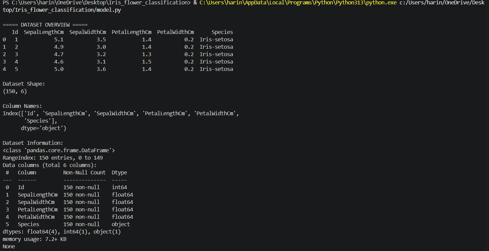
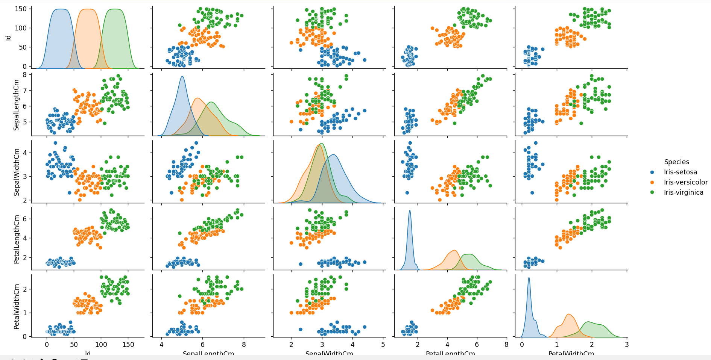
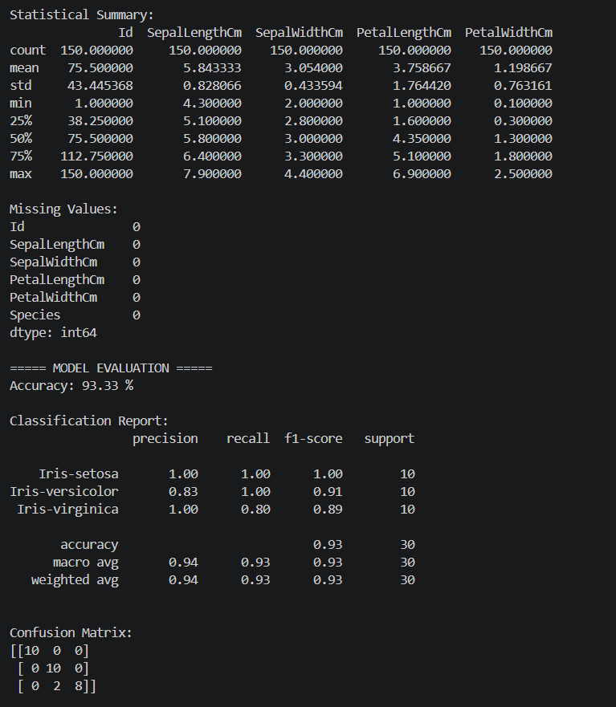
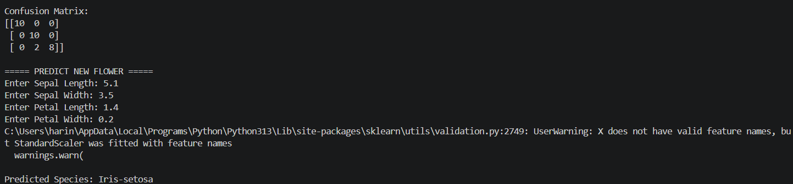

# 🌸 Iris Flower Classification using K-Nearest Neighbors (KNN)

## 📌 Project Overview

This project uses Machine Learning to classify Iris flowers into three species:

* Iris Setosa
* Iris Versicolor
* Iris Virginica

The model is built using the K-Nearest Neighbors (KNN) algorithm and predicts flower species based on sepal and petal measurements.

---

## 🎯 Objectives

* Perform Exploratory Data Analysis (EDA)
* Visualize the Iris dataset
* Train a Machine Learning model
* Evaluate model performance
* Predict flower species using user-provided measurements

---

## 📊 Dataset Information

The Iris dataset contains 150 flower samples with the following features:

* SepalLengthCm
* SepalWidthCm
* PetalLengthCm
* PetalWidthCm

### Target Variable

* Species

---

## 🛠 Technologies Used

* Python
* Pandas
* Seaborn
* Matplotlib
* Scikit-learn

---

## 🤖 Machine Learning Algorithm

### K-Nearest Neighbors (KNN)

KNN classifies a flower by comparing it with the nearest data points in the dataset and assigning the most common class among its neighbors.

---

## ⚙️ Project Workflow

1. Load the dataset
2. Perform Data Exploration
3. Visualize the dataset using Seaborn Pairplot
4. Split data into training and testing sets
5. Apply Feature Scaling using StandardScaler
6. Train the KNN model
7. Evaluate the model using:

   * Accuracy Score
   * Confusion Matrix
   * Classification Report
8. Predict flower species from user input

---

## 📈 Model Performance

### Accuracy

**93.33%**

### Evaluation Metrics

* Accuracy Score
* Confusion Matrix
* Classification Report

---

## 📷 Project Screenshots

### Dataset Overview



### Data Visualization



### Model Evaluation



### Prediction Output



---

## ▶️ Installation

Install the required libraries:

```bash
pip install pandas seaborn matplotlib scikit-learn
```

---

## ▶️ Run the Project

```bash
python main.py
```

---

## 💡 Example Prediction

Input:

```text
Sepal Length: 5.1
Sepal Width: 3.5
Petal Length: 1.4
Petal Width: 0.2
```

Output:

```text
Predicted Species: Iris-setosa
```

---

## 👩‍💻 Author

**Harini D**

B.Tech Artificial Intelligence and Data Science
